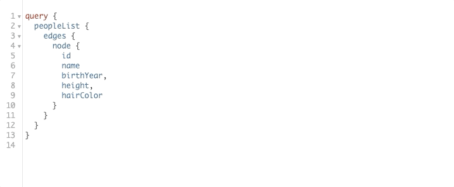

Graphene with Flask and SQLAlchemy
================================

This example project demos integration between Graphene (Python Framework for GraphQL), Flask and SQLAlchemy.

How to run locally
---------------

Create a virtualenv (optional):
```bash
virtualenv venv
source venv/bin/activate
```

Run the docker container:
```bash
docker-compose up -d   
```

Navigate to the web UI:
```bash
open http://localhost:5000/graphql
```

Example query with filters
---------------
